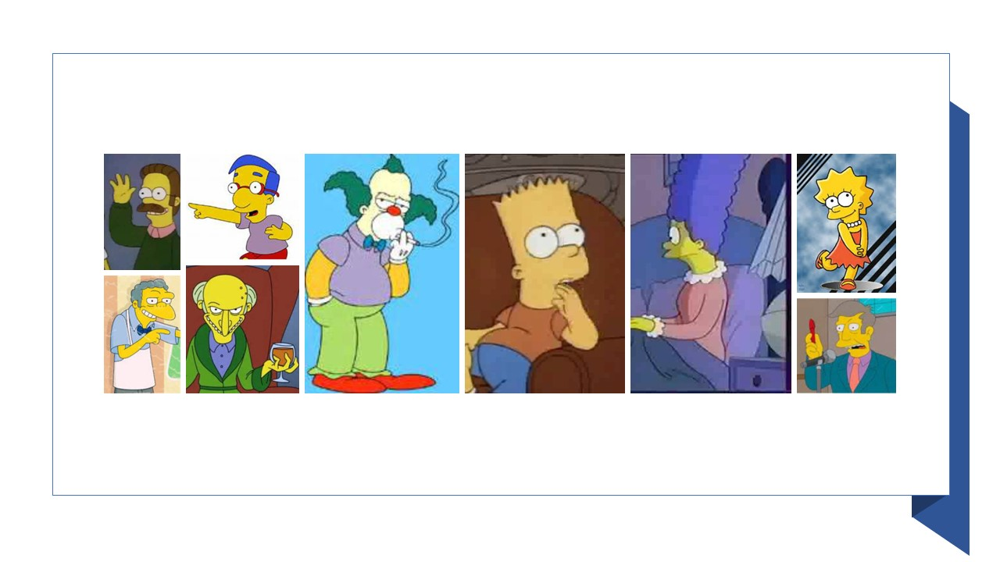

# simpson_classifier
## Classifier for character in "The Simpsons"  (on progress)


## Dataset Info
(on progress)
## Model info
I trained model with <b>EfficientNet</b> (https://arxiv.org/abs/1905.11946)  
and use pre-trained model from <b>geffnet</b> (https://github.com/rwightman/gen-efficientnet-pytorch)  
Due to GPU RAM capacity, I use <b>'tf_efficientnet_b5_ns'</b> model with <b>Image size = 456</b>  
I applied data augmentation below using albumentations
```
alb_train_transform = A.Compose([
    A.Resize(image_size, image_size),
    A.ShiftScaleRotate(shift_limit=0.05,
                       scale_limit=0.05,
                       rotate_limit=15,
                       p=0.5),
    A.HorizontalFlip(),                       
    A.RGBShift(r_shift_limit=15, g_shift_limit=15, b_shift_limit=15, p=0.5),
    A.RandomBrightnessContrast(p=0.5),
    A.GaussNoise(p=0.3),
    A.Normalize((0.5, 0.5, 0.5), (0.5, 0.5, 0.5)),
    ToTensorV2()
])
```
and train model with below settings
```
batch = 24 
epoch = 20
learning_rate = 1e-5

criterion = nn.CrossEntropyLoss()

optimizer = optim.Adam(params=model.parameters(), lr=learning_rate)

scheduler = optim.lr_scheduler.CosineAnnealingLR(optimizer=optimizer,
                                                 T_max=5,
                                                 eta_min=1e-7,
                                                 last_epoch=-1,
                                                 verbose=False)
```
### Result
validation acc: <b>99.81 </b>
Test acc: <b>99.12</b>
## How to  
Install the dependencies:
```
pip install -r requirements.txt
```
and please run app.py  
<b>if you start server with "flask run" torch can't load trained model.</b>  
  
after turning on server, start python interpreter and type below code
```
import requests

resp = requests.post("http://localhost:5000/predict", files={"file": open('./image_samples/{your_file_name}.jpeg','rb')})
```
then you can check result at
```
resp.json()
```

## Available inputs and outputs
|Name|Label|
|-|-|
|Bart simpson|0|
|charles_monthomery|1|
|Krusty|2|
|Lisa_simpson|3|
|Marge_simpson|4|
|Milhouse|5|
|Moe_szyslak|6|
|Ned_flanders|7|
|principal_skinner|8|
